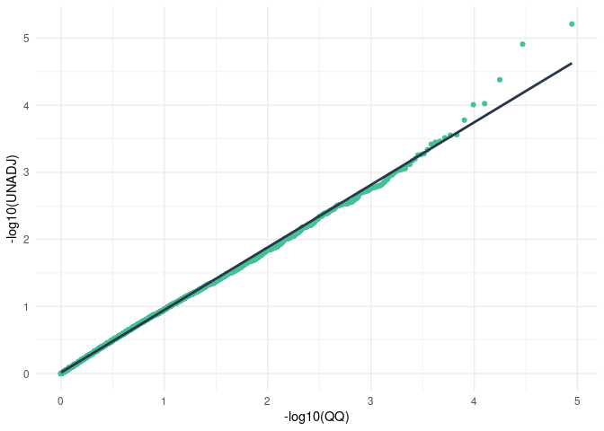
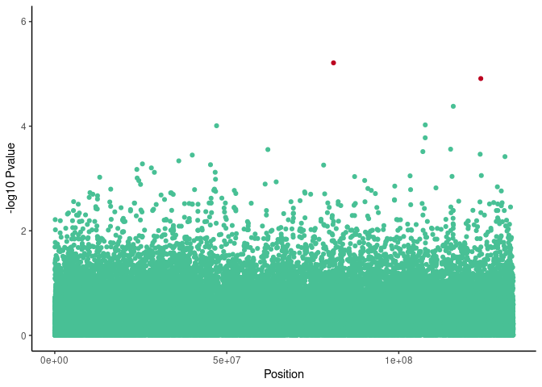

OAS\_analysis
================

Results on 1076 unrelated individuals

    ## Joining, by = "SNP"

    ## `geom_smooth()` using formula 'y ~ x'

<!-- -->

    ## Warning: Removed 4 rows containing missing values (geom_point).

<!-- -->

<!-- ```{r OR plot, echo=FALSE} -->
<!-- severe %>% filter(chr_col == 's') %>% distinct() %>% -->
<!--   #left_join(vep_cardiac, by = 'SNP') %>% na.omit() %>% -->
<!--   ggplot(aes(y=reorder(SNP,-OR),x=OR)) +  -->
<!--   geom_point(col="#48C095") + -->
<!--   geom_text(aes(label=SYMBOL),hjust=-0.2, vjust=0.2) + -->
<!--   geom_vline(xintercept = 1,linetype='dashed',col="#BC0020") + -->
<!--   ylab('SNP') + -->
<!--   xlab('Odds ratio') + -->
<!--   ggtitle('Estimated odds ratio (OR) of minor allele occurence',  -->
<!--           subtitle = 'Red dashed line: OR = 1.0') + -->
<!--   theme_classic() + -->
<!--   theme(plot.title = element_text(hjust = 0.5), -->
<!--         plot.subtitle = element_text(hjust=0.5)) -->
<!-- ``` -->

### Significant variants

| SNP                               | Symbol |   Pvalue |    OR |
|:----------------------------------|:-------|---------:|------:|
| chr12\_81034511\_G\_GTAAATAAATAAA | ACSS3  | 6.20e-06 | 2.218 |
| chr12\_123847218\_T\_TTATCTATC    | DNAH10 | 1.23e-05 | 2.756 |

<!-- ### Variants in high LD with significant variants -->
<!-- ```{r haplotypes, echo=F} -->
<!-- sigs <- head(severe$SNP,2) -->
<!-- blocks <- fread('/mnt/theta/output_data/MS_gwas_data/output/haploblock/haploblock.maf0.01.blocks.det') -->
<!-- blocks <- blocks %>% filter(grepl(sigs[1],blocks$SNPS) | grepl(sigs[2],blocks$SNPS)) -->
<!-- SNPS <- unlist(str_split(blocks$SNPS[1],pattern = '\\|')) -->
<!-- # vep_block <- vep %>% filter(SNP %in% SNPS) %>%  -->
<!--   filter(IMPACT != 'MODIFIER') -->
<!-- freq_fisher <- fread('/mnt/theta/output_data/MS_gwas_data/output/cardiac/cardiac.assoc.fisher') %>% -->
<!--   right_join(vep_block) -->
<!-- kable(vep_block) -->
<!-- ``` -->
