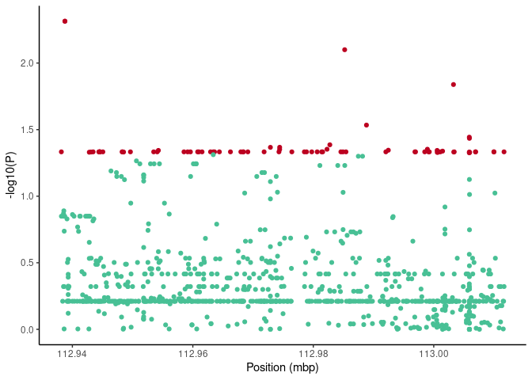

OAS\_panel
================

## 1. Cohort information

<!-- -->

Control label include mild benign and resistant response to COVID-19
infection

## 2. Results

Association study was performed by comparison of allele counts in cases
and controls with Chi-square test. Significance of variants is expressed
in form of q-values which are FDR adjusted p-values.

<!-- -->

### Manhattan plot

Red points are SNPs with qvalue &lt; 0.32

<!-- -->

<!-- -->

| SNP                              | SYMBOL | A2          | A1  | case\_count | ctrl\_count |    qvalue |     OR |
|:---------------------------------|:-------|:------------|:----|------------:|------------:|----------:|-------:|
| chr12\_112938171\_A\_G           | OAS3   | A           | G   |           1 |           0 | 0.3138914 |     NA |
| chr12\_112938761\_GCTT\_G        | OAS3   | GCTT        | G   |           2 |           0 | 0.3138914 |     NA |
| chr12\_112938765\_A\_G           | OAS3   | A           | G   |           2 |           0 | 0.3138914 |     NA |
| chr12\_112943090\_A\_G           | OAS3   | A           | G   |           1 |           0 | 0.3138914 |     NA |
| chr12\_112943444\_C\_T           | OAS3   | C           | T   |           1 |           0 | 0.3138914 |     NA |
| chr12\_112944393\_C\_T           | OAS3   | C           | T   |           1 |           0 | 0.3138914 |     NA |
| chr12\_112944476\_G\_T           | OAS3   | G           | T   |           1 |           0 | 0.3138914 |     NA |
| chr12\_112944549\_C\_T           | OAS3   | C           | T   |           1 |           0 | 0.3138914 |     NA |
| chr12\_112944557\_C\_T           | OAS3   | C           | T   |           1 |           0 | 0.3138914 |     NA |
| chr12\_112944577\_C\_T           | OAS3   | C           | T   |           1 |           0 | 0.3138914 |     NA |
| chr12\_112945064\_C\_T           | OAS3   | C           | T   |           1 |           0 | 0.3138914 |     NA |
| chr12\_112948252\_T\_C           | OAS3   | T           | C   |           1 |           0 | 0.3138914 |     NA |
| chr12\_112948349\_G\_A           | OAS3   | G           | A   |           1 |           0 | 0.3138914 |     NA |
| chr12\_112948503\_A\_C           | OAS3   | A           | C   |           1 |           0 | 0.3138914 |     NA |
| chr12\_112949638\_C\_T           | OAS3   | C           | T   |           1 |           0 | 0.3138914 |     NA |
| chr12\_112953503\_G\_A           | OAS3   | G           | A   |           1 |           0 | 0.3138914 |     NA |
| chr12\_112954087\_T\_A           | OAS3   | T           | A   |           1 |           0 | 0.3138914 |     NA |
| chr12\_112954281\_TTTG\_T        | OAS3   | TTTG        | T   |          74 |         230 | 0.3138914 | 1.3440 |
| chr12\_112954281\_TTTG\_T        | OAS3   | TTTG        | T   |          74 |         230 | 0.3138914 | 1.3440 |
| chr12\_112958531\_T\_G           | OAS3   | T           | G   |           1 |           0 | 0.3138914 |     NA |
| chr12\_112959140\_G\_A           | OAS3   | G           | A   |           1 |           0 | 0.3138914 |     NA |
| chr12\_112959600\_T\_C           | OAS3   | T           | C   |           1 |           0 | 0.3138914 |     NA |
| chr12\_112960802\_G\_T           | OAS3   | G           | T   |           1 |           0 | 0.3138914 |     NA |
| chr12\_112961003\_G\_T           | OAS3   | G           | T   |           1 |           0 | 0.3138914 |     NA |
| chr12\_112961532\_T\_TC          | OAS3   | T           | TC  |           1 |           0 | 0.3138914 |     NA |
| chr12\_112962941\_C\_A           | OAS3   | C           | A   |           1 |           0 | 0.3138914 |     NA |
| chr12\_112963407\_G\_T           | OAS3   | G           | T   |           1 |           0 | 0.3138914 |     NA |
| chr12\_112963599\_G\_A           | OAS3   | G           | A   |           1 |           0 | 0.3138914 |     NA |
| chr12\_112964409\_G\_T           | OAS3   | G           | T   |           1 |           0 | 0.3138914 |     NA |
| chr12\_112966245\_C\_A           | OAS3   | C           | A   |           1 |           0 | 0.3138914 |     NA |
| chr12\_112967973\_C\_G           | OAS3   | C           | G   |           1 |           0 | 0.3138914 |     NA |
| chr12\_112968324\_G\_A           | OAS3   | G           | A   |           1 |           0 | 0.3138914 |     NA |
| chr12\_112968406\_T\_C           | OAS3   | T           | C   |           1 |           0 | 0.3138914 |     NA |
| chr12\_112969133\_C\_CA          | OAS3   | C           | CA  |           1 |           0 | 0.3138914 |     NA |
| chr12\_112971835\_G\_A           | OAS3   | G           | A   |           1 |           0 | 0.3138914 |     NA |
| chr12\_112974299\_G\_A           | OAS3   | G           | A   |           1 |           0 | 0.3138914 |     NA |
| chr12\_112974418\_CT\_C          | OAS3   | C           | CT  |          92 |         434 | 0.3138914 | 0.7483 |
| chr12\_112974418\_CT\_C          | OAS3   | C           | CT  |          92 |         434 | 0.3138914 | 0.7483 |
| chr12\_112974418\_CT\_C          | OAS3   | C           | CT  |          92 |         434 | 0.3138914 | 0.7483 |
| chr12\_112976440\_A\_G           | OAS3   | A           | G   |           1 |           0 | 0.3138914 |     NA |
| chr12\_112978520\_G\_C           | OAS2   | G           | C   |           1 |           0 | 0.3138914 |     NA |
| chr12\_112978879\_C\_T           | OAS2   | C           | T   |           1 |           0 | 0.3138914 |     NA |
| chr12\_112979742\_C\_T           | OAS2   | C           | T   |           1 |           0 | 0.3138914 |     NA |
| chr12\_112980650\_G\_A           | OAS2   | G           | A   |           1 |           0 | 0.3138914 |     NA |
| chr12\_112981393\_A\_G           | OAS2   | A           | G   |           1 |           0 | 0.3138914 |     NA |
| chr12\_112981558\_T\_G           | OAS2   | T           | G   |           1 |           0 | 0.3138914 |     NA |
| chr12\_112982282\_A\_G           | OAS2   | A           | G   |           2 |           1 | 0.3138914 | 7.9630 |
| chr12\_112982746\_T\_C           | OAS2   | T           | C   |         105 |         343 | 0.3138914 | 1.3040 |
| chr12\_112984582\_T\_C           | OAS2   | T           | C   |           1 |           0 | 0.3138914 |     NA |
| chr12\_112984926\_C\_T           | OAS2   | C           | T   |           1 |           0 | 0.3138914 |     NA |
| chr12\_112985211\_G\_A           | OAS2   | G           | A   |           5 |           4 | 0.3138914 | 5.0070 |
| chr12\_112985425\_C\_A           | OAS2   | C           | A   |           1 |           0 | 0.3138914 |     NA |
| chr12\_112988827\_T\_C           | OAS2   | T           | C   |         106 |         340 | 0.3138914 | 1.3270 |
| chr12\_112992047\_T\_A           | OAS2   | T           | A   |           1 |           0 | 0.3138914 |     NA |
| chr12\_112992457\_G\_T           | OAS2   | G           | T   |           1 |           0 | 0.3138914 |     NA |
| chr12\_112996876\_G\_A           | OAS2   | G           | A   |           1 |           0 | 0.3138914 |     NA |
| chr12\_112996974\_C\_T           | OAS2   | C           | T   |           1 |           0 | 0.3138914 |     NA |
| chr12\_112998502\_C\_T           | OAS2   | C           | T   |           1 |           0 | 0.3138914 |     NA |
| chr12\_112998946\_T\_C           | OAS2   | T           | C   |           2 |           1 | 0.3138914 | 7.9630 |
| chr12\_112999149\_G\_A           | OAS2   | G           | A   |           1 |           0 | 0.3138914 |     NA |
| chr12\_112999260\_G\_A           | OAS2   | G           | A   |           1 |           0 | 0.3138914 |     NA |
| chr12\_113000562\_TGCACACAC\_T   | OAS2   | TGCACACAC   | T   |           2 |           1 | 0.3138914 | 7.9100 |
| chr12\_113000579\_G\_A           | OAS2   | G           | A   |           1 |           0 | 0.3138914 |     NA |
| chr12\_113000707\_CCATGCACACA\_C | OAS2   | CCATGCACACA | C   |           1 |           0 | 0.3138914 |     NA |
| chr12\_113001098\_C\_G           | OAS2   | C           | G   |           1 |           0 | 0.3138914 |     NA |
| chr12\_113001465\_TACATATATAC\_T | OAS2   | TACATATATAC | T   |           1 |           0 | 0.3138914 |     NA |
| chr12\_113001465\_TACATATATAC\_T | OAS2   | TACATATATAC | T   |           1 |           0 | 0.3138914 |     NA |
| chr12\_113003274\_T\_C           | OAS2   | T           | C   |           4 |           3 | 0.3138914 | 5.3300 |
| chr12\_113003325\_T\_G           | OAS2   | T           | G   |           1 |           0 | 0.3138914 |     NA |
| chr12\_113003396\_C\_T           | OAS2   | C           | T   |           1 |           0 | 0.3138914 |     NA |
| chr12\_113005902\_A\_AC          | OAS2   | A           | AC  |           1 |           0 | 0.3138914 |     NA |
| chr12\_113005962\_C\_T           | OAS2   | C           | T   |           1 |           0 | 0.3138914 |     NA |
| chr12\_113006936\_C\_T           | OAS2   | C           | T   |           1 |           0 | 0.3138914 |     NA |
| chr12\_113006946\_C\_G           | OAS2   | C           | G   |           1 |           0 | 0.3138914 |     NA |
| chr12\_113009982\_T\_C           | OAS2   | T           | C   |           1 |           0 | 0.3138914 |     NA |
| chr12\_113009994\_A\_AG          | OAS2   | A           | AG  |           1 |           0 | 0.3138914 |     NA |
| chr12\_113011668\_T\_C           | OAS2   | T           | C   |           1 |           0 | 0.3138914 |     NA |

Variants with q-value &lt; 0.32
