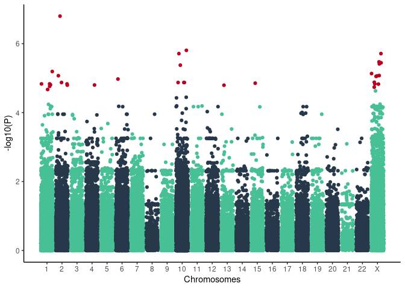

ensembl\_cardiac\_diseases\_panel\_20200715
================

## 1. Cohort information

<!-- -->

Control label include mild benign and resistant response to COVID-19
infection

## 2. Results

Association study was performed by comparison of allele counts in cases
and controls with Chi-square test. Significance of variants is expressed
in form of q-values which are FDR adjusted p-values.

<!-- -->

### Manhattan plot

Red points are SNPs with qvalue &lt; 0.1

<!-- -->

<!-- -->

| SNP                       | SYMBOL | A2    | A1  | case\_count | ctrl\_count |    qvalue |      OR |
|:--------------------------|:-------|:------|:----|------------:|------------:|----------:|--------:|
| chr2\_21016723\_A\_G      | APOB   | A     | G   |          19 |          15 | 0.0233792 |  5.2320 |
| chr10\_21161770\_T\_C     | NEBL   | T     | C   |           7 |           1 | 0.0715223 | 28.2400 |
| chrX\_33220344\_C\_T      | DMD    | C     | T   |           7 |           1 | 0.0715223 | 28.2400 |
| chr10\_74037468\_A\_G     | VCL    | A     | G   |          11 |           6 | 0.0774518 |  7.4530 |
| chrX\_31855196\_G\_GTT    | DMD    | G     | GTT |         169 |         479 | 0.0774518 |  1.7170 |
| chrX\_33269258\_T\_TA     | DMD    | T     | TA  |          23 |          27 | 0.0774518 |  3.5290 |
| chr1\_6005073\_A\_G       | KCNAB2 | A     | G   |          53 |         350 | 0.0788635 |  0.4698 |
| chr1\_237293073\_CCAAG\_C | RYR2   | CCAAG | C   |           6 |           1 | 0.0788635 | 24.1400 |
| chr1\_237381426\_T\_C     | RYR2   | T     | C   |           6 |           1 | 0.0788635 | 24.1400 |
| chr2\_21016739\_C\_G      | APOB   | C     | G   |          11 |           7 | 0.0788635 |  6.3840 |
| chr2\_26242159\_G\_C      | HADHA  | C     | G   |         141 |         745 | 0.0788635 |  0.6026 |
| chr2\_26258591\_G\_A      | HADHB  | A     | G   |         147 |         775 | 0.0788635 |  0.5951 |
| chr2\_73394538\_C\_T      | ALMS1  | C     | T   |           6 |           1 | 0.0788635 | 24.1400 |
| chr4\_105460858\_C\_T     | PPA2   | C     | T   |           7 |           2 | 0.0788635 | 14.1000 |
| chr6\_123242822\_C\_T     | TRDN   | C     | T   |          16 |          15 | 0.0788635 |  4.3690 |
| chr10\_74074713\_A\_G     | VCL    | A     | G   |          11 |           7 | 0.0788635 |  6.3840 |
| chr10\_74081652\_CTT\_C   | VCL    | CTT   | C   |          11 |           7 | 0.0788635 |  6.3840 |
| chr10\_74092803\_G\_A     | VCL    | G     | A   |          11 |           7 | 0.0788635 |  6.3840 |
| chr13\_36907734\_T\_A     | SMAD9  | T     | A   |          14 |          12 | 0.0788635 |  4.7620 |
| chrX\_31897699\_T\_C      | DMD    | T     | C   |         128 |         345 | 0.0788635 |  1.7090 |
| chrX\_32031143\_AG\_A     | DMD    | AG    | A   |          49 |         352 | 0.0788635 |  0.4836 |
| chrX\_32302606\_T\_C      | DMD    | T     | C   |          67 |         435 | 0.0788635 |  0.5260 |
| chrX\_32727831\_A\_C      | DMD    | A     | C   |           6 |           1 | 0.0788635 | 24.1400 |
| chr1\_6005071\_A\_T       | KCNAB2 | A     | T   |          23 |         209 | 0.0819746 |  0.3807 |
| chr1\_6005071\_A\_T       | KCNAB2 | A     | T   |          23 |         209 | 0.0819746 |  0.3807 |
| chr1\_3425762\_G\_C       | PRDM16 | G     | C   |          12 |           9 | 0.0953094 |  5.4240 |

Variants with q-value &lt; 0.1
