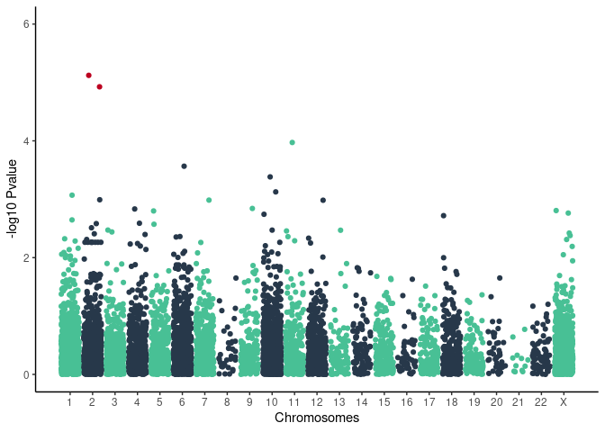

ensembl\_cardiac\_diseases\_panel\_20200715
================

Results on 1076 unrelated individuals 8129 variants with MAF &gt; 0.01
and LD pruning (indep-pairwise 50 5 0.05)

    ## Joining, by = "SNP"
    ## Joining, by = "SNP"

    ## `geom_smooth()` using formula 'y ~ x'

<!-- -->

<!-- -->

<!-- -->

| SYMBOL | SNP                  |   Pvalue | FDR\_BH |     OR |
|:-------|:---------------------|---------:|--------:|-------:|
| HADHA  | chr2\_26242159\_G\_C | 7.50e-06 | 0.04818 | 0.5781 |
| HADHB  | chr2\_26258591\_G\_A | 1.19e-05 | 0.04818 | 0.5869 |
