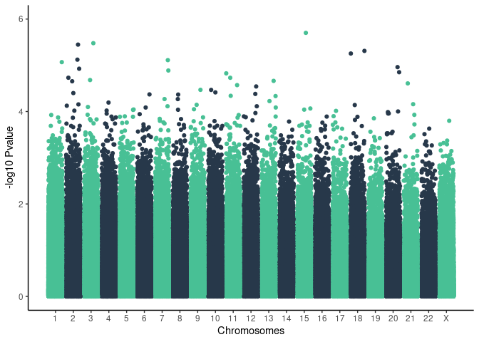
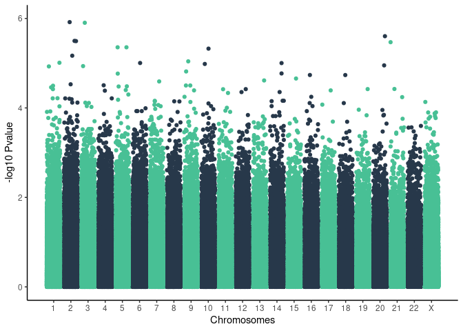

common variants
================

Results on 1076 unrelated individuals

    ## Joining, by = "SNP"
    ## Joining, by = "SNP"

### Severe manhattan plot

    ## Warning: Removed 28 rows containing missing values (geom_point).

<!-- -->

### Top 15 severe results

| SYMBOL     | IMPACT   | Consequence                                      | SNP                      |   Pvalue | FDR\_BH | FDR\_BY |
|:-----------|:---------|:-------------------------------------------------|:-------------------------|---------:|--------:|--------:|
| CCDC32     | MODIFIER | downstream\_gene\_variant                        | chr15\_40553905\_CGT\_C  | 2.00e-06 |  0.9881 |       1 |
| AC068633.1 | MODIFIER | intron\_variant,non\_coding\_transcript\_variant | chr3\_118226220\_A\_T    | 3.30e-06 |  0.9881 |       1 |
| DRC1       | MODIFIER | intron\_variant                                  | chr2\_26447115\_A\_T     | 3.60e-06 |  0.9881 |       1 |
| RIT2       | MODIFIER | intron\_variant                                  | chr18\_43077939\_G\_A    | 4.90e-06 |  0.9881 |       1 |
| \-         | MODIFIER | intergenic\_variant                              | chr18\_43141170\_C\_T    | 5.60e-06 |  0.9881 |       1 |
| HADHA      | MODIFIER | intron\_variant                                  | chr2\_26242159\_G\_C     | 7.50e-06 |  0.9881 |       1 |
| DGKB       | MODIFIER | upstream\_gene\_variant                          | chr7\_14905244\_GT\_G    | 7.70e-06 |  0.9881 |       1 |
| \-         | MODIFIER | regulatory\_region\_variant                      | chr1\_2859612\_A\_G      | 8.50e-06 |  0.9881 |       1 |
| \-         | MODIFIER | regulatory\_region\_variant                      | chr20\_11159860\_G\_A    | 1.10e-05 |  0.9881 |       1 |
| HADHB      | MODIFIER | intron\_variant                                  | chr2\_26258591\_G\_A     | 1.19e-05 |  0.9881 |       1 |
| \-         | MODIFIER | intergenic\_variant                              | chr7\_45443910\_A\_ATGTG | 1.30e-05 |  0.9881 |       1 |
| \-         | MODIFIER | intergenic\_variant                              | chr20\_40828006\_C\_T    | 1.41e-05 |  0.9881 |       1 |
| \-         | MODIFIER | intergenic\_variant                              | chr11\_66379908\_C\_CAAA | 1.49e-05 |  0.9881 |       1 |
| SELENOI    | MODIFIER | intron\_variant                                  | chr2\_26371642\_C\_T     | 1.86e-05 |  0.9881 |       1 |
| AP002991.1 | MODIFIER | intron\_variant,non\_coding\_transcript\_variant | chr11\_115732655\_G\_A   | 1.86e-05 |  0.9881 |       1 |

    ## Warning: Removed 18 rows containing missing values (geom_point).

<!-- -->
