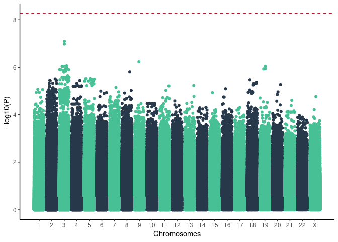
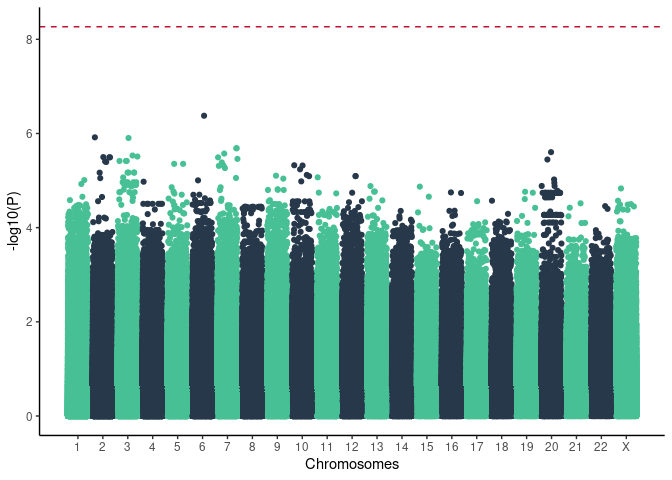

### 1. Common variants

9243540 variants with MAF &gt; 0.01 and LD pruning (indep-pairwise 50 5
0.05)

<!-- -->

| Gene   | SNP                  | A1  | TEST | NMISS |    OR |  STAT |     P |         q |
|:-------|:---------------------|:----|:-----|------:|------:|------:|------:|----------:|
| LZTFL1 | chr3\_45868036\_C\_T | T   | ADD  |   947 | 2.367 | 5.316 | 1e-07 | 0.4841316 |
| LZTFL1 | chr3\_45868152\_C\_A | A   | ADD  |   966 | 2.379 | 5.366 | 1e-07 | 0.4841316 |

<https://www.medrxiv.org/content/10.1101/2021.03.31.21254708v1>

<!-- -->

<!-- ### 2. Rare variants -->
<!-- ```{r regenie_out, echo=F} -->
<!-- ``` -->
