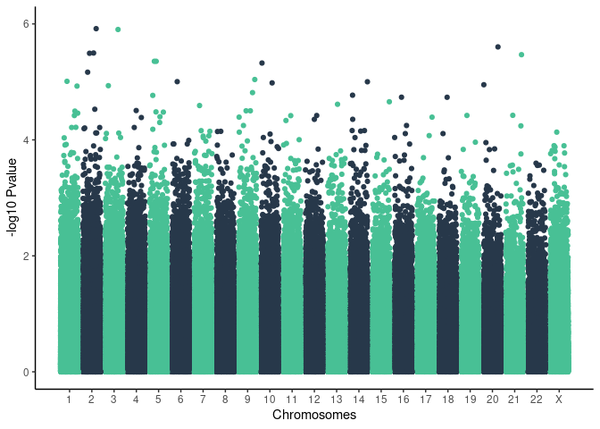

common variants
================

Results on 1076 unrelated individuals and 973,771 SNPs

    ## Joining, by = "SNP"
    ## Joining, by = "SNP"
    ## Joining, by = "SNP"

### Severe manhattan plot

    ## Warning: Removed 29 rows containing missing values (geom_point).

<!-- -->

### Top 15 severe results

| SNP                      | SYMBOL     | Consequence                                      |   Pvalue |     OR |
|:-------------------------|:-----------|:-------------------------------------------------|---------:|-------:|
| chr15\_40553905\_CGT\_C  | CCDC32     | downstream\_gene\_variant                        | 2.00e-06 | 9.1970 |
| chr3\_118226220\_A\_T    | AC068633.1 | intron\_variant,non\_coding\_transcript\_variant | 3.30e-06 | 5.3640 |
| chr2\_26447115\_A\_T     | DRC1       | intron\_variant                                  | 3.60e-06 | 0.5676 |
| chr18\_43077939\_G\_A    | RIT2       | intron\_variant                                  | 4.90e-06 | 3.8150 |
| chr18\_43141170\_C\_T    | \-         | intergenic\_variant                              | 5.60e-06 | 3.6550 |
| chr2\_26242159\_G\_C     | HADHA      | intron\_variant                                  | 7.50e-06 | 0.5781 |
| chr7\_14905244\_GT\_G    | DGKB       | upstream\_gene\_variant                          | 7.70e-06 | 3.7990 |
| chr1\_2859612\_A\_G      | \-         | regulatory\_region\_variant                      | 8.50e-06 | 4.4610 |
| chr20\_11159860\_G\_A    | \-         | regulatory\_region\_variant                      | 1.10e-05 | 0.5755 |
| chr2\_26258591\_G\_A     | HADHB      | intron\_variant                                  | 1.19e-05 | 0.5869 |
| chr7\_45443910\_A\_ATGTG | \-         | intergenic\_variant                              | 1.30e-05 | 5.3350 |
| chr20\_40828006\_C\_T    | \-         | intergenic\_variant                              | 1.41e-05 | 4.2320 |
| chr11\_66379908\_C\_CAAA | \-         | intergenic\_variant                              | 1.49e-05 | 4.5090 |
| chr2\_26371642\_C\_T     | SELENOI    | intron\_variant                                  | 1.86e-05 | 0.5921 |
| chr11\_115732655\_G\_A   | AP002991.1 | intron\_variant,non\_coding\_transcript\_variant | 1.86e-05 | 4.9040 |

### Resistors manhattan

    ## Warning: Removed 22 rows containing missing values (geom_point).

<!-- -->
