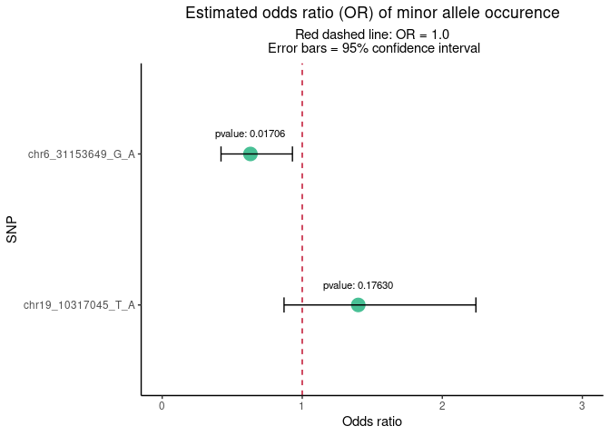
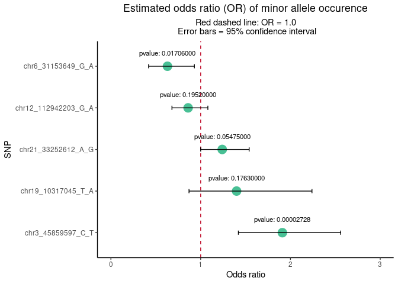

COVID test
================

### Analysis conducted with Fisher’s exact test with Lancaster’s mid-p adjustment

### 1. Results for COVID test SNPs

| SNP                   | CHR |       BP | A2  | A1  | F\_cases | F\_controls | P       |   OR |   SE |  L95 |  U95 |
|:----------------------|----:|---------:|:----|:----|---------:|------------:|:--------|-----:|-----:|-----:|-----:|
| chr6\_31153649\_G\_A  |   6 | 31153649 | G   | A   |     0.07 |        0.11 | 0.01706 | 0.63 | 0.20 | 0.42 | 0.93 |
| chr19\_10317045\_T\_A |  19 | 10317045 | T   | A   |     0.06 |        0.04 | 0.17630 | 1.40 | 0.24 | 0.87 | 2.24 |

<!-- -->

### 2. Results for lead variants from independent genome-wide significant regions in study: <https://www.nature.com/articles/s41586-020-03065-y>

| SNP                    | CHR |        BP | A2  | A1  | F\_cases | F\_controls | P          |   OR |   SE |  L95 |  U95 |
|:-----------------------|----:|----------:|:----|:----|---------:|------------:|:-----------|-----:|-----:|-----:|-----:|
| chr3\_45859597\_C\_T   |   3 |  45859597 | C   | T   |     0.17 |        0.10 | 0.00002728 | 1.91 | 0.15 | 1.42 | 2.56 |
| chr6\_31153649\_G\_A   |   6 |  31153649 | G   | A   |     0.07 |        0.11 | 0.01706000 | 0.63 | 0.20 | 0.42 | 0.93 |
| chr21\_33252612\_A\_G  |  21 |  33252612 | G   | A   |     0.39 |        0.34 | 0.05475000 | 1.24 | 0.11 | 1.00 | 1.54 |
| chr19\_10317045\_T\_A  |  19 |  10317045 | T   | A   |     0.06 |        0.04 | 0.17630000 | 1.40 | 0.24 | 0.87 | 2.24 |
| chr12\_112942203\_G\_A |  12 | 112942203 | A   | G   |     0.28 |        0.32 | 0.19520000 | 0.86 | 0.12 | 0.68 | 1.08 |
| chr19\_4719431\_G\_A   |  19 |   4719431 | G   | A   |     0.32 |        0.31 | 0.50890000 | 1.08 | 0.11 | 0.86 | 1.35 |
| chr6\_32212369\_A\_G   |   6 |  32212369 | G   | A   |     0.12 |        0.12 | 0.77580000 | 1.05 | 0.16 | 0.76 | 1.44 |
| chr6\_29831017\_A\_G   |   6 |  29831017 | A   | G   |     0.29 |        0.29 | 0.97660000 | 1.00 | 0.12 | 0.80 | 1.26 |

<!-- -->
