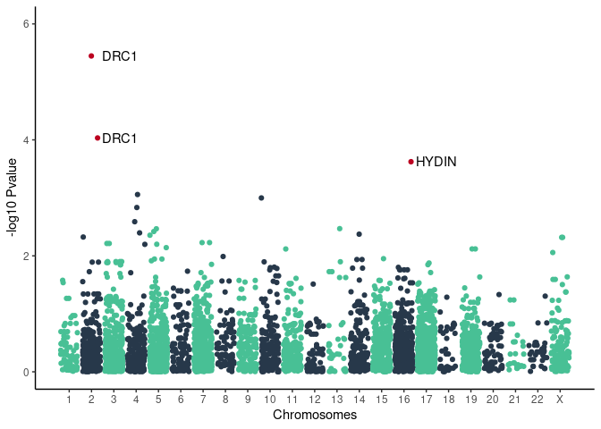

pulmo\_panel
================

Results on 1076 unrelated individuals and 4,464 SNPs

    ## Joining, by = "SNP"
    ## Joining, by = "SNP"

    ## `geom_smooth()` using formula 'y ~ x'

<!-- -->

<!-- -->

<!-- -->

| SNP                    | SYMBOL | Consequence     |   Pvalue |     OR |
|:-----------------------|:-------|:----------------|---------:|-------:|
| chr2\_26447115\_A\_T   | DRC1   | intron\_variant | 3.60e-06 | 0.5676 |
| chr2\_26405653\_CTT\_C | DRC1   | intron\_variant | 9.26e-05 | 1.5630 |
| chr16\_71164275\_T\_C  | HYDIN  | intron\_variant | 2.38e-04 | 4.5880 |
